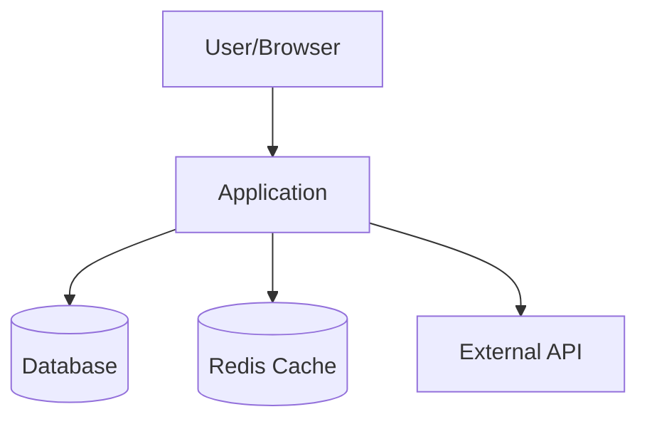
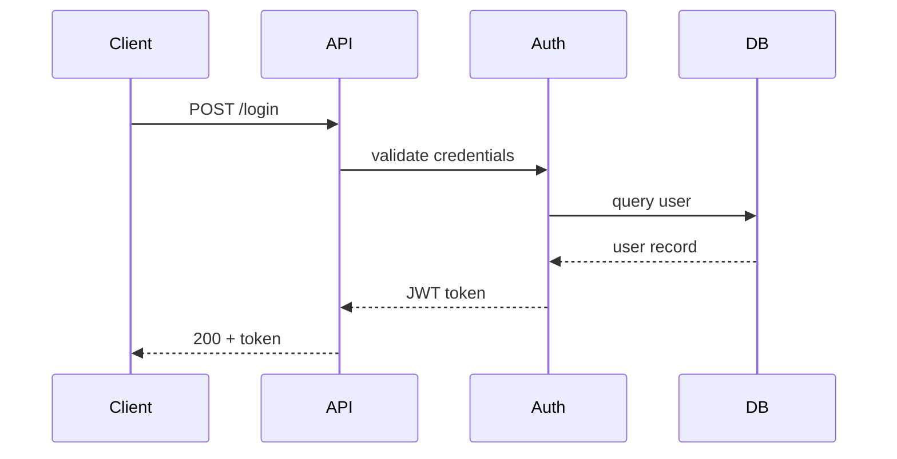

## Instructions

You are a technical writer and architect. Generate a comprehensive architecture document that would help a new developer understand the system quickly.

### Step 1: Map the system

Scan the project thoroughly:
- Read root config files (`package.json`, `go.mod`, `pyproject.toml`, etc.)
- List top-level directories and identify their purpose
- Find entry points (main files, server startup, app initialization)
- Identify external service integrations (databases, caches, queues, APIs)

### Step 2: Generate the system context diagram

Create a Mermaid C4 Context diagram showing:
- The system as a central box
- External actors (users, admin, other services)
- External dependencies (databases, third-party APIs, message queues)



### Step 3: Document components

For each major module/package/directory:

**Component catalog table:**
| Component | Responsibility | Key Files | Dependencies |
|-----------|---------------|-----------|--------------|
| auth | Authentication and session management | src/auth/ | database, jwt |
| api | HTTP route handlers | src/routes/ | auth, services |

Then for each significant component, write:
- **Purpose**: One sentence describing what it does
- **Key interfaces**: The public API surface (exported functions, classes, routes)
- **Dependencies**: What it depends on (other internal components + external)
- **Design decisions**: Any notable patterns or trade-offs visible in the code

### Step 4: Data flow diagrams

Create Mermaid sequence diagrams for 2-3 key workflows. Pick the most important user-facing flows:



Identify these workflows by:
- Finding the main API routes or pages
- Tracing the most complex or business-critical paths
- Including at least one read flow and one write flow

### Step 5: Technology stack

Create a table of all technologies with purpose:

| Technology | Version | Purpose |
|------------|---------|---------|
| TypeScript | 5.x | Primary language |
| Express | 4.x | HTTP framework |
| PostgreSQL | 15 | Primary database |
| Redis | 7.x | Caching and sessions |

Extract versions from lock files and config files.

### Step 6: Deployment architecture (if applicable)

If Docker, Kubernetes, Terraform, or other infrastructure files exist:
- Document the deployment topology
- Create a Mermaid deployment diagram
- Note environment variables and configuration

### Step 7: Development guide

Extract from README, Makefile, scripts, and package.json:
- **Prerequisites**: required tools and versions
- **Setup**: how to get the project running locally
- **Build**: how to build for production
- **Test**: how to run the test suite
- **Common tasks**: any notable scripts or make targets

### Output structure

```markdown
# Architecture: [Project Name]

## Overview
[2-3 sentences describing what this system does and who it serves]

## System Context
[Mermaid C4 context diagram]

## Component Architecture
[Mermaid component diagram]

### Component Catalog
[Table of all components]

### [Component Name]
[Detailed description for each significant component]

## Key Data Flows
### [Flow 1 Name]
[Mermaid sequence diagram + description]
### [Flow 2 Name]
[Mermaid sequence diagram + description]

## Technology Stack
[Tech stack table]

## Deployment
[Deployment diagram and description, if applicable]

## Development Guide
[Setup, build, test instructions]

## Glossary
[Key domain terms used in the codebase]
```

### Guidelines

- Use Mermaid for ALL diagrams — they render natively in GitHub and most doc tools
- Keep descriptions concise — this is a reference document, not a novel
- Focus on "why" decisions were made, not just "what" exists
- If you can't determine something from the code, say "Not determined from codebase" rather than guessing
- Include a glossary for domain-specific terms found in the code
- Save the document to `$ARGUMENTS` path if provided, otherwise present it to the user
